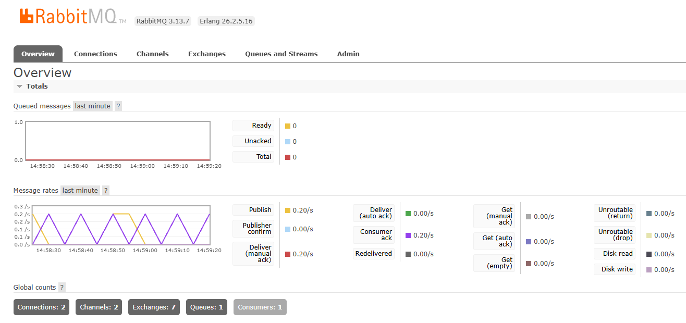
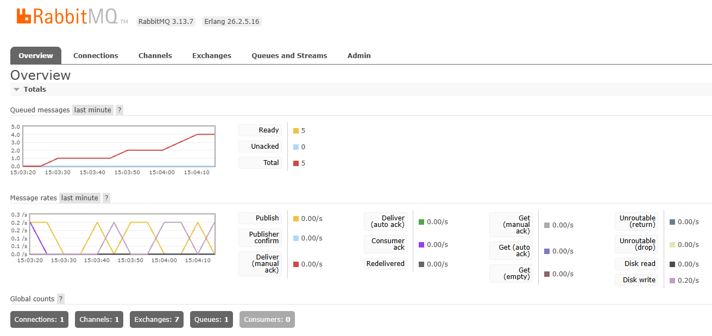

# Serviço de mensageria Cliente-Servidor via RabbitMQ

O RabbitMQ é uma ferramenta que possibilita o queue de mensagens entre processos. Neste código, o `producer` envia uma mensagem ao queue a cada 10 segundos, do qual o `consumer` irá receber e confirmar pelo terminal Python / logs.



Acima, é possível ver que cada mensagem enviada pelo `producer` é lida pelo `consumer`, deixando nenhuma mensagem na queue.



Porém, se `consumer` estiver inativo enquanto `producer` está ativo, as mensagens se acumulam na queue até `consumer` ficar ativo novamente.

## Install

Necessário usar [Docker Desktop](https://www.docker.com/products/docker-desktop/) para rodar o RabbitMQ. Caso esteja usando o Windows como sistema operacional, verifique os [requisitos operacionais](https://docs.docker.com/desktop/setup/install/windows-install/).

Em um terminal dentro do projeto, use:

```bash
docker compose up --build
```

Para acessar o RabbitMQ na web, digite na barra de endereço: `localhost:15672`

```text
Username: guest
Password: guest
```

Para encerrar todos os processos:

```bash
docker compose down
```

> Feito para o curso de Bacharelado em Engenharia da Computação do [Centro Universitário Fundação Santo André](https://www2.fsa.br/home/).
